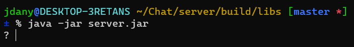

# That!
Implementation of a chat server.

The client for this server can be found [here](https://github.com/J-Dany/ChatClient.git)

## Index
- [Dependencies](#dependencies)
- [Configuration](#configuration)
- [Installation](#installation)
- [Execution](#execution)

## Dependencies
- [Gradle](https://gradle.org/)
- Java (>= 11)
- Database [mysql](https://www.mysql.com/)

## Configuration
You can configure this server using the ```.env``` file in ```server/src/main/resources/.env```.
The parameters you can configure for now are:
- **LOG_FILE_PATH**: the path for the log file. The server logs everything, so you can easily find the problem
- **HISTORY_FILE_PATH**: Currently not used
- **MAX_USERS**: the maximum number of users that this chat will handle (by default the maximum is 32)
- **MAX_MESSAGE_BEFORE_MUTE**: That! provides a system for muting and banning people. This value identifies the maximum number of message that a user can sender before being muted
- **MAX_MESSAGE_BEFORE_BAN**: Like **MAX_MESSAGE_BEFORE_MUTE**, but this time is for banning clients
- **Database information**: That! needs access to database in order to authenticate users, store messages, create groups and so on. The ```db.sql``` file, in the root of the project, contains DDL instructions for creating the database.
The parameters you can configure are the following:
    - **DB_NAME**: the name of the database (the name contained in ```db.sql``` is *chat*)
    - **DB_USER**: the name of the user that have all privileges on the database *chat*
    - **DB_PASSWD**: the password of **DB_USER**
    - **DB_HOST**: socket (IP:port) of the database server

## Installation
In order to build the entire application, you need to run the followind command:
```bash
./gradlew build
```
This will create a directory inside ```server```, called ```build```. Inside ```server/build/libs``` there is the jar file that you can execute to run That!. Here the command for running the jar:
```bash
java -jar server.jar
```

## Execution
When you run the application, you have access to a sort of "console". In fact, once the app has started, print out ```?```:



For now, you can use these commands:
- **exit** || **stop** || **close** => stops the server
- **connected** => prints out clients that are connected right now
- **history** => prints out the list of command typed before
- **gui** => starts a graphical interface that can handle the server

##### Made by Daniele Castiglia